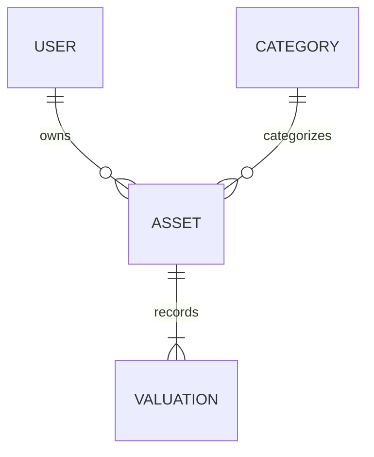

# Data Model for AssetsBoard

This document describes the data model for the **AssetsBoard** project. It covers the primary entities, their attributes, relationships, and provides a visual representation using a mermaid diagram.

## Main Entities

### Asset

- **Description**: Represents an investment asset owned by a user.
- **Attributes**:
  - **id**: number - Unique identifier for the asset.
  - **name**: string - Name of the asset.
  - **value**: number - Value of the asset.
  - **quantity**: number - Quantity of the asset owned.
  - **acquisition_date**: Date - Date when the asset was acquired.
  - **category_id**: number - Foreign key linking to the asset's category.
  - **user_id**: number - Foreign key linking to the owner (user) of the asset.
  - **created_at**: DateTime - Timestamp of asset creation.
  - **updated_at**: DateTime - Timestamp of last asset update.

### Category

- **Description**: Categorizes assets based on their type.
- **Attributes**:
  - **id**: number - Unique identifier for the category.
  - **name**: string - Name of the category.
  - **description**: string - Description of the category.
  - **risk**: boolean - Flag indicating if this category represents risky assets.
  - **liquidity**: boolean - Flag indicating if assets in this category are liquid.
  - **created_at**: DateTime - Timestamp of category creation.
  - **updated_at**: DateTime - Timestamp of last category update.

### Valuation

- **Description**: Records the valuation history of an asset.
- **Attributes**:
  - **id**: number - Unique identifier for the valuation record.
  - **asset_id**: number - Foreign key linking to the asset.
  - **valuation_date**: Date - Date of valuation.
  - **valuation**: number - The valuation figure at the given date.
  - **created_at**: DateTime - Timestamp of valuation record creation.
  - **updated_at**: DateTime - Timestamp of last update.

### User

- **Description**: Represents a private investor using the platform.
- **Attributes**:
  - **id**: number - Unique identifier for the user.
  - **name**: string - Name of the user.
  - **email**: string - User's email address.
  - **password**: string - Hashed password for user authentication.
  - **created_at**: DateTime - Timestamp of user creation.
  - **updated_at**: DateTime - Timestamp of last user update.

## Relationships

- **User** one-to-many **Asset**
  - Description: A user can own multiple assets.
- **Category** one-to-many **Asset**
  - Description: Each asset belongs to one category while a category can encompass multiple assets.
- **Asset** one-to-many **Valuation**
  - Description: An asset can have multiple valuation records over time.

## Mermaid Diagram

_End of Data Model Document for AssetsBoard_
