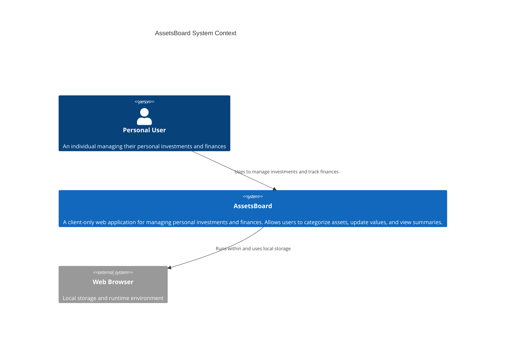

#   AssetsBoard Briefing

AssetsBoard is a client-only web application designed for managing personal investments and finances.

## Application
- **Name**: AssetsBoard
- **Type of Application**: Client-only web app
- **Purpose**: Help manage personal investments and finances
- **Audience**: Personal use
- **Must-have features**:
  - Categorize assets
  - Update asset values
  - View summaries

## Context diagram

## Summary

AssetsBoard is a client-only web application for personal use that helps users manage their investments and finances.

AssetsBoard must allow:

- 1 - As a user, I want to categorize assets so that I can organize my investments effectively.
- 2 - As a user, I want to update asset values so that I can keep my financial records accurate.
- 3 - As a user, I want to view summaries so that I can track my overall financial position.

