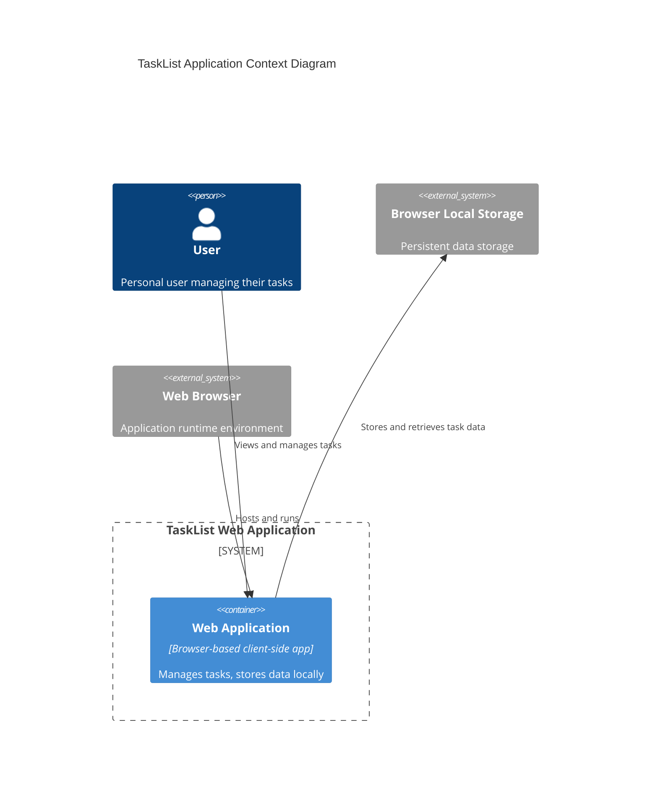

## Context diagram for TaskList

TaskList is a simple web app client only for personal use that helps to manage my tasks.

This is the context diagram for TaskList.

```mermaid
C4Context
    title TaskList Application Context Diagram
    
    Person(user, "User", "Personal user managing their tasks")
    
    System_Boundary(taskList, "TaskList Web Application") {
        Container(webapp, "Web Application", "Browser-based client-side app", "Manages tasks, stores data locally")
    }
    
    System_Ext(localStorage, "Browser Local Storage", "Persistent data storage")
    System_Ext(browser, "Web Browser", "Application runtime environment")
    
    Rel(user, webapp, "Views and manages tasks")
    Rel(webapp, localStorage, "Stores and retrieves task data")
    Rel(browser, webapp, "Hosts and runs")
```