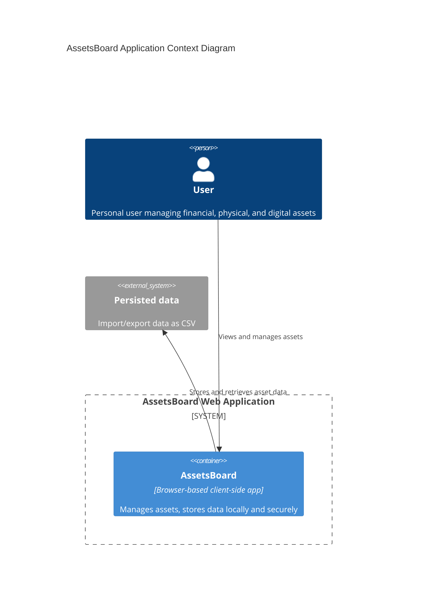

# 2.1 AssetsBoard - Analysis - System Architecture

This document outlines the system architecture for the AssetsBoard application.

> **AssetsBoard** is a personal web-based application designed for comprehensive asset management, enabling users to manage financial, physical, and digital assets securely and efficiently.

## System Overview
The system is designed to be secure, user-friendly, and maintainable while leveraging modern web technologies. Below are the key components:

### Front End
- **TypeScript**: The application is written in TypeScript for improved maintainability and type safety.
- **JavaScript Framework**: Utilizes vanilla JavaScript with modern standards and web components for modularity and reusability.
- **Styling**:
  - Employs PicoCSS to provide a lightweight and modern styling framework.
  - Ensures consistent cross-browser styling.
- **Build Tool**: Vite is used for fast builds and efficient development.
- **Testing**:
  - Playwright is employed for end-to-end testing to validate user interactions and functionality.

### Back End
- **None**: AssetsBoard is fully client-side and does not rely on a backend server.

### Database
- **Local Storage**:
  - Asset data is stored as JSON objects in the browser's local storage.
  - This ensures data privacy and immediate accessibility.

### Server
- **Static File Server**:
  - Hosts the Single Page Application (SPA) and serves the static files required to run the application.

### Authentication
- **None**:
  - User accounts and traditional authentication are not required.
  - Data encryption is managed by a runtime-provided password.

### Integrations
- **Data Import/Export**:
  - Users can export asset data to CSV files and import them back for migration or backup purposes.

## Architectural Diagram
Below is the context diagram for the AssetsBoard system:

### Rationale for Design Choices
- **Client-Side Architecture**:
  - Simplifies deployment and eliminates server-side dependencies.
  - Ensures user data remains private and stored locally.
- **Styling with PicoCSS**:
  - Lightweight and easy to integrate, providing modern and responsive designs.
- **Local Storage**:
  - Offers immediate data access and ensures independence from external services.
- **Data Import/Export**:
  - CSV format supports compatibility with common tools and systems.
- **Modern Tools**:
  - TypeScript and Vite provide a robust and efficient development experience.

## Conclusion
The proposed architecture for AssetsBoard ensures a secure, lightweight, and user-centric solution. The design is scalable for future enhancements, such as advanced analytics or multi-device synchronization.

