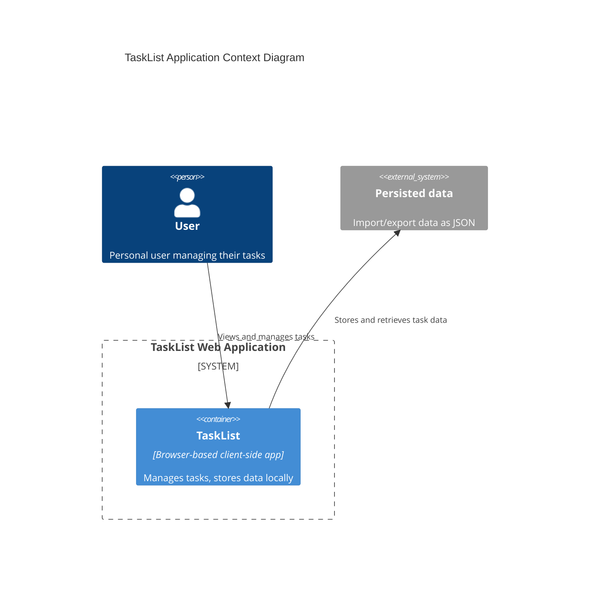

# 2.1 TaskList - Analysis - System Architecture

This document outlines the system architecture for the TaskList application.

> TaskList is a simple web app client only for personal use that helps to manage my tasks.

## System Overview

The solution will consist of the following key components:

### Front end 
- A web SPA
- Code is written in TypeScript
- Uses JS framework (vanilla and modern standards like web components)
- No CSS framework (vanilla and modern resets like PicoCSS)
- Uses Vite as build tool
- Uses Playwright for e2e testing

### Back end 
- none

### Database 
- Local storage
- JSON arrays of tasks

### Server 
- a static file server to host the SPA

### Authentication : 
- none, but could encrypt data
- encryption/decryption password will be asked at runtime

### Integrations : 
- none, but could export/import data as JSON

