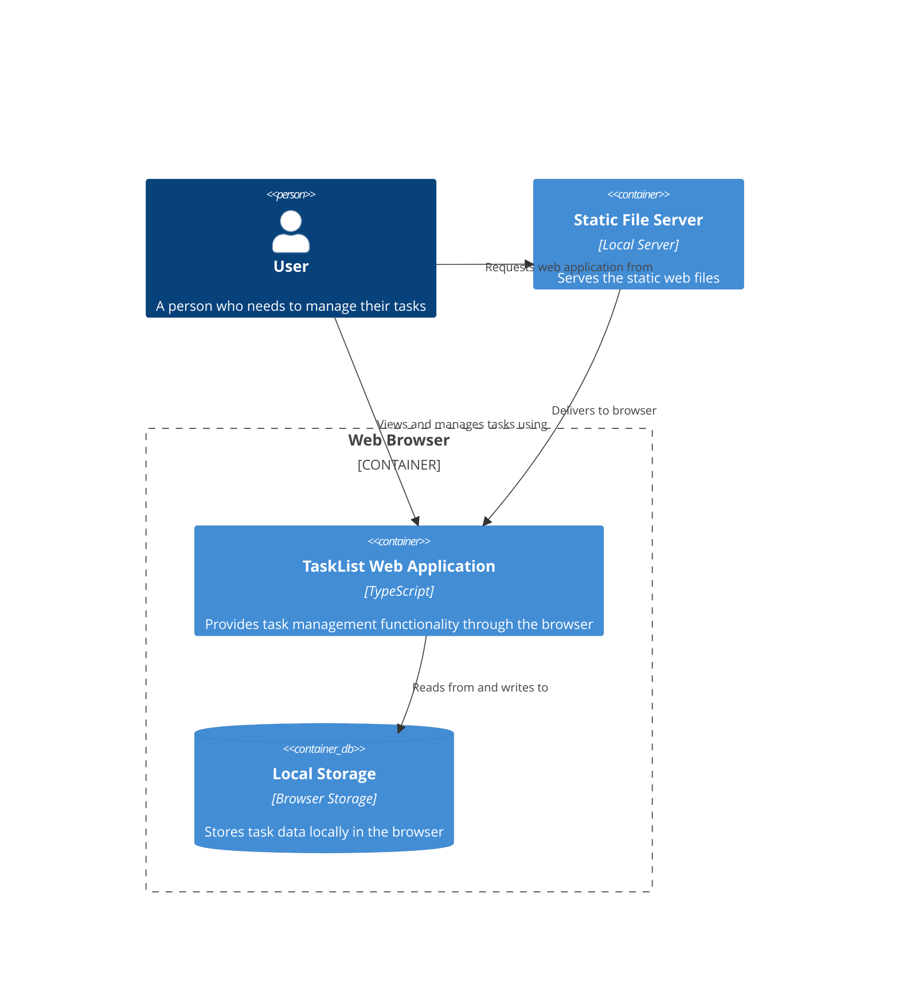

# TaskList System Components

## Components

### Front-end: 
- A web app client only.
- Typescript with no framework.

### Back-end: 
- No back-end. Only a static file server.
 
### Database: 
- To store tasks.
- Local storage.

### Server: 
- Local 

### Authentication: 
- No authentication.

### CI/CD: 
- Test with playwright.

### Third-party integrations: 
- None.

## Diagram

