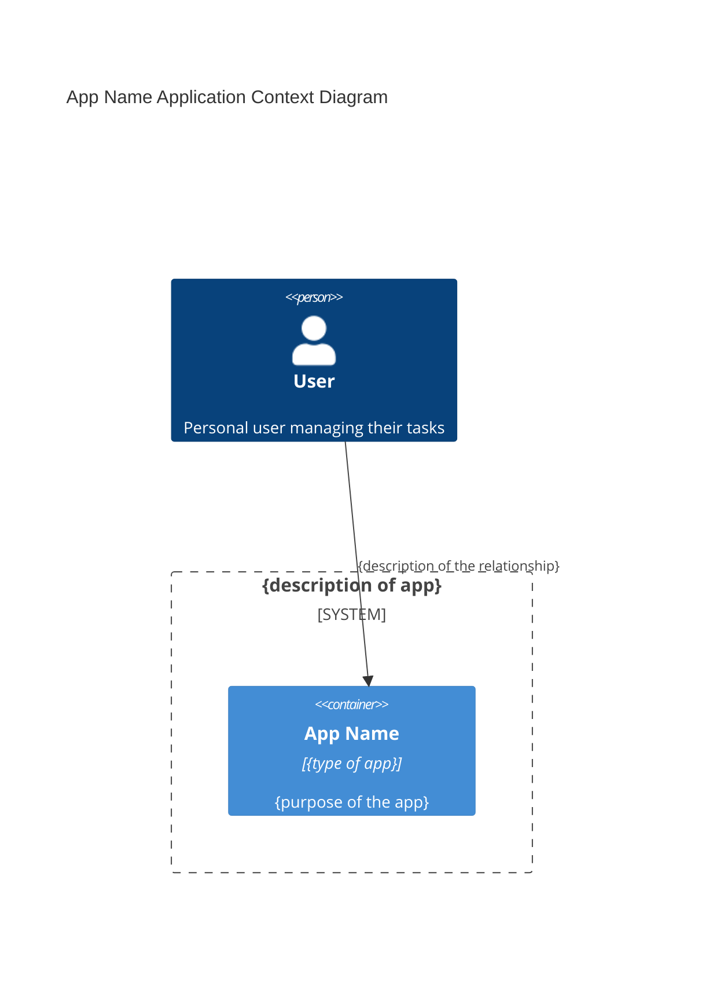

# 2.1 App Name - Analysis - System Architecture

> `2_1.app-name_analysis_system-architecture.md`

This document outlines the system architecture for the **App Name** application;{overview from briefing}

## System Overview

The solution will consist of the following key **components**:

### Front end 
- details

### Back end 
- details

### Database 
- details

### Server 
- details

### Security : 
- details

### Integrations : 
- details

