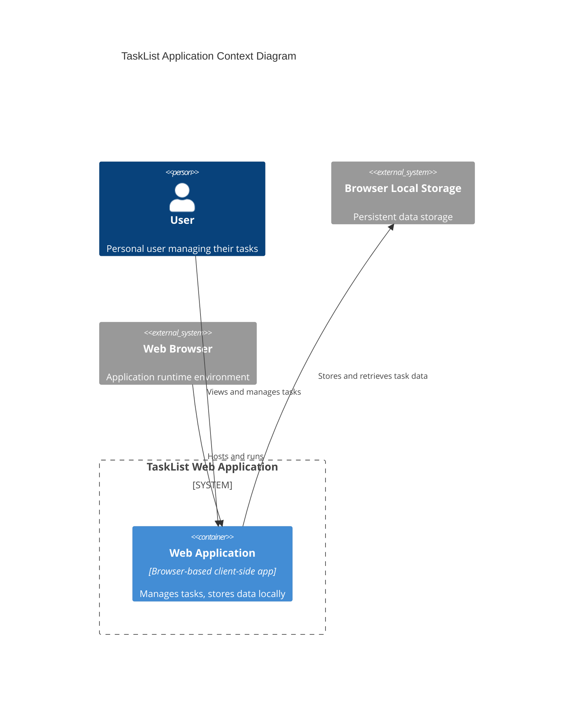

# TaskList Briefing

A simple task list for personal use.

## Application

- 1 - **Name**: TaskList
- 2 - **Type of Application**: Web app client only
- 3 - **Purpose**: Help to manage my tasks
- 4 - **Audience**: Personal
- 5 - **Must have**: Add, remove, edit and mark a task as done. View pending and completed tasks.

## Context diagram

## Summary

TaskList is a simple web app client only for personal use that helps to manage my tasks.

TaskList must allow :

- 1 - As a `user` I want `add a task`	so that `I can keep track of my tasks`
- 2 - As a `user` I want `remove a task`	so that `I can remove a task`
- 3 - As a `user` I want `edit a task`	so that `I can change my mind about a task`
- 4 - As a `user` I want `mark a task as done`	so that `I can save my work done`
- 5 - As a `user` I want `view pending tasks`	so that `I can keep track of work to do`
- 6 - As a `user` I want `view completed tasks`	so that `I can keep track of work done`

