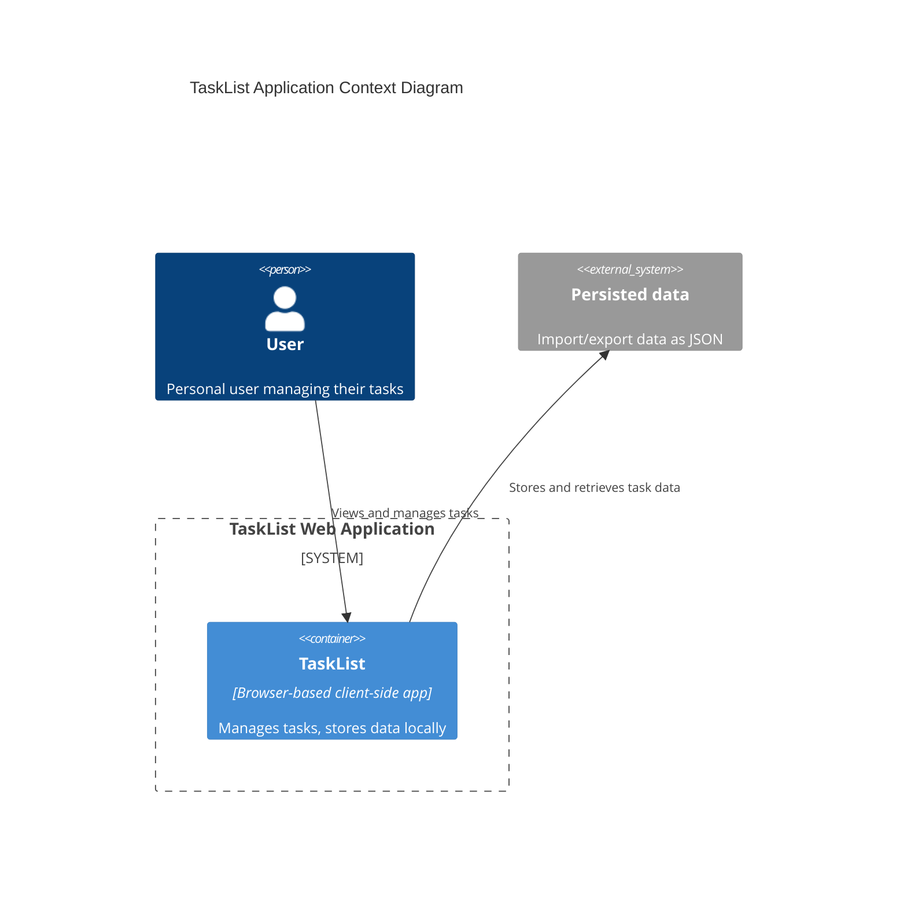

# 2.1 TaskList - Analysis - System Architecture

> `2_1.task-list_analysis_system-architecture.md`

This document outlines the system architecture for the **TaskList** application; a simple web app client only for personal use that helps to manage my tasks. It stores data in the browser local storage and uses a minimalistic responsive interface.

## System Overview

The solution will consist of the following key **components**:

### Front end 
- A web SPA
- No JS nor CSS framework (only vanilla typescript and modern html/css standards)
- Uses Vite as build tool
- Uses Playwright for e2e testing
- Run with Bun, Node or Deno

### Back end 
- none

### Database 
- Local storage
- JSON arrays of tasks

### Server 
- a static file server to host the SPA
- Vite preview is enough

### Security : 
- no authentication nor authorization
- nice to have: encryption/decryption storage password will be asked at runtime

### Integrations : 
- none, but could export/import data as JSON

