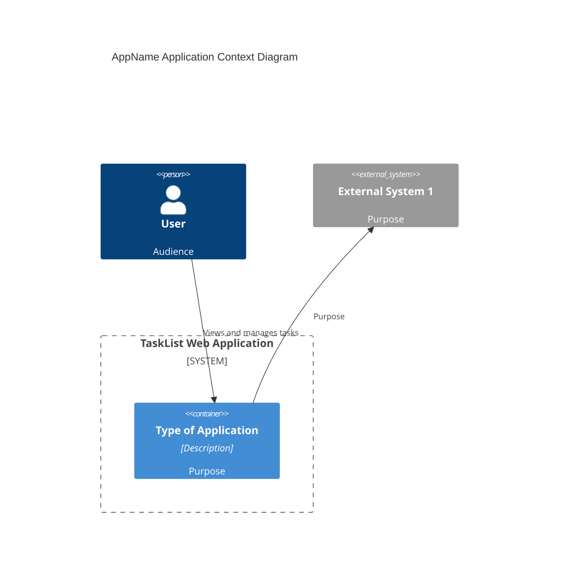

## Context diagram

`AppName` is a `Type of application` for `Audience` that solves `Purpose`.

This is the context diagram for `AppName`.

```mermaid
C4Context
    title AppName Application Context Diagram
    
    Person(user, "User", "Audience")
    
    System_Boundary(appName, "TaskList Web Application") {
      Container(typeAppName, "Type of Application", "Description", "Purpose")
    }
    
    System_Ext(external1, "External System 1", "Purpose")

    Rel(user, typeAppName, "Views and manages tasks")
    Rel(typeAppName, external1, "Purpose")
```