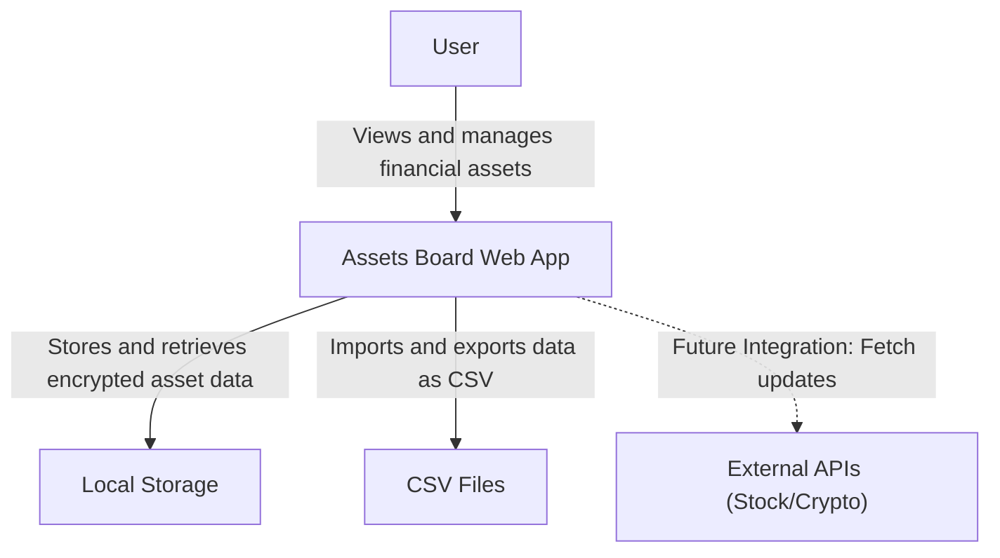

# 2.1 Assets Board - Analysis - System Architecture

`2_1.assets-board_analysis_system-architecture.md`

This document outlines the system architecture for the **Assets Board** application, a web-based solution for personal financial monitoring that prioritizes simplicity, privacy, and responsiveness.

## System Overview

The solution consists of the following key **components**:

### Front-End
- **Language**: TypeScript
- **Component System**: Web Components (without Shadow DOM, allowing global styling)
- **Styling**: PicoCSS for resets and custom CSS variables for global styles
- **Build Tool**: Vite for development and static builds
- **Framework**: None (vanilla TypeScript for simplicity)

### Back-End
- **None**: Fully client-side application
- **Static File Hosting**: Vite Preview for local development, with options for static hosting platforms (e.g., Netlify or GitHub Pages).

### Database
- **Storage Mechanism**: LocalStorage
- **Encryption**: Sensitive data (e.g., financial asset details) will be encrypted using modern JavaScript `SubtleCrypto` APIs with a user-provided password. Metadata such as categories will remain unencrypted.

### Security

- **User Privacy**: All data remains local to the user's browser to ensure maximum privacy.
- **Encryption**: Sensitive data encrypted at runtime, without relying on external libraries.

### Integrations

- **Data Export**: Save data as a CSV file, compatible with tools like Excel.
- **Data Import**: Restore data via CSV uploads.
- **Planned**: API connections for stock/crypto updates in the future.

## System Context Diagram

---

This architecture ensures simplicity and privacy while leaving room for future enhancements such as real-time data integration.

