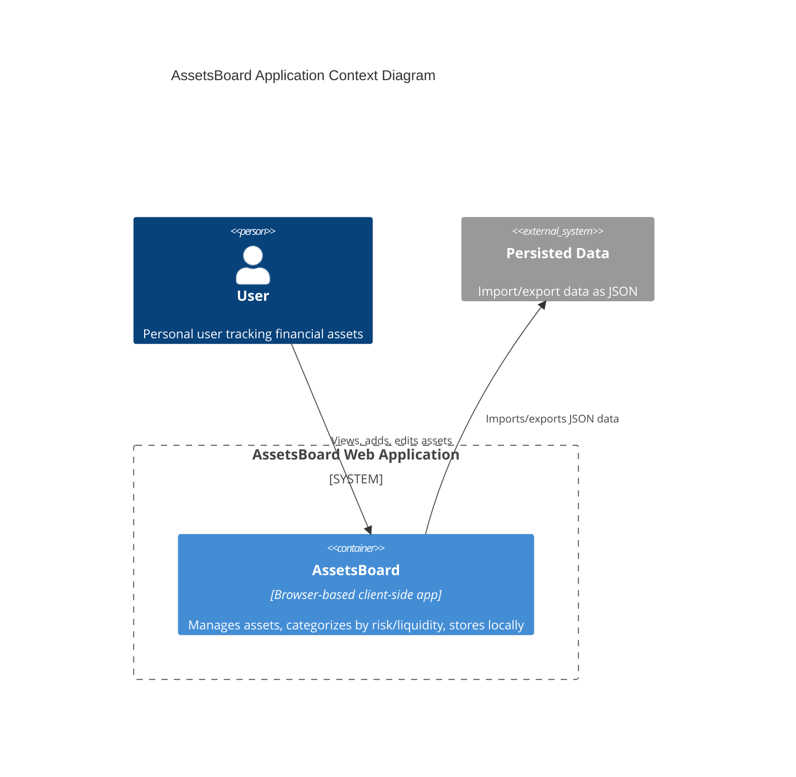

**Document Generated**  

---

# 2.1 AssetsBoard - Analysis - System Architecture  
`2_1.assets-board_analysis_system-architecture.md`  

This document outlines the system architecture for the **AssetsBoard** application, a client-only web app for summarizing and analyzing personal financial assets. It stores data locally in the browser and uses a minimalistic interface with optional encryption.  

---

## System Overview  
The solution consists of the following components:  

### Frontend  
- **Single-Page Application (SPA)** built with:  
  - Vanilla TypeScript (no frameworks).  
  - Modern HTML/CSS standards (Grid/Flexbox, CSS variables and PicoCSS reset).  
- **Build Tool**: Vite for bundling and optimization.  
- **Testing**: Playwright for end-to-end testing (e.g., asset addition, data persistence).  
- **Runtime**: Compatible with Bun, Node.js, or Deno.  

### Backend  
- **None** (client-only architecture).  

### Database  
- **Browser Local Storage**:  
  - Stores asset data as JSON arrays (e.g., `{ id: "1", name: "Stock Portfolio", category: "stocks",  value: 50000, valueDate: "2025-01-27" }`).  

### Server  
- **Static File Hosting**:  
  - Serves the SPA via Vite’s preview server or a simple HTTP server (e.g., `serve`).  

### Security  
- **No Authentication/Authorization** (single-user focus).  
- **Optional Encryption**:  
  - If enabled, user-provided password encrypts/decrypts stored data at runtime.  

### Integrations  
- **JSON Import/Export**:  
  - Users can upload/download asset data as JSON files.  

---

---

## Key Technical Decisions  
1. **No Backend**: Ensures privacy and simplicity; all logic runs client-side.  
2. **Local Storage**: Eliminates server costs and guarantees offline usability.  
3. **Vanilla TypeScript**: Reduces dependency bloat and improves maintainability.  

