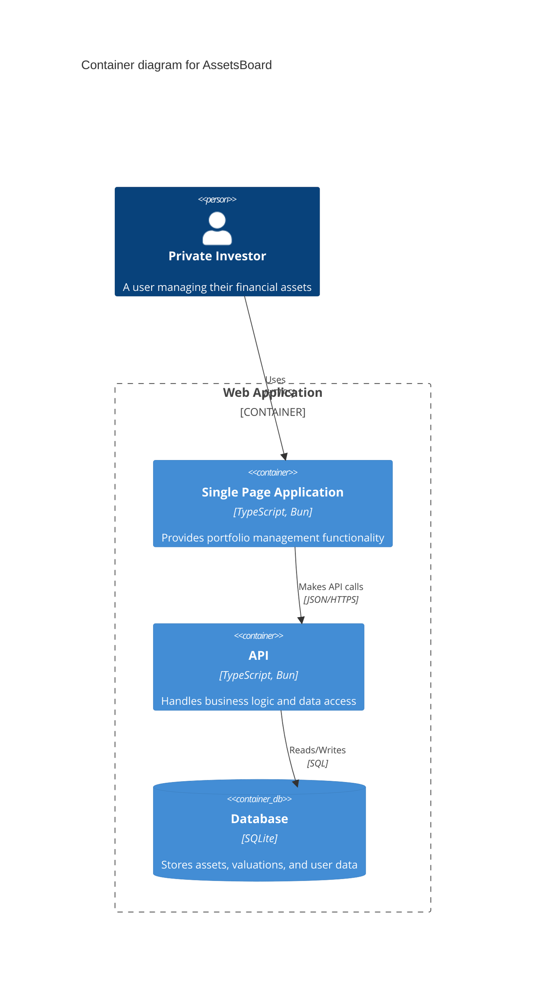

# System architecture for **AssetsBoard**

## Overview

AssetsBoard is a web application for private investors designed to categorize and summarize their investments, providing clear insights and organized portfolio summaries.

## Frontend

### Tech Stack

- **Language**: TypeScript
- **Framework**: Bun_Vanilla_TS
- **Styling**: PicoCSS
- **State Management**: None
- **Routing**: None
- **API**: Fetch

### Architecture

- Layered
- Functional
- Folder structure

  ```
  - src/
    - app/ (pages and repositories)
    - models/ (data models)
    - utils/ (helpers and shared components)
  ```

### Presentation

- Single Page Application
- Responsive, Dark_Mode
- Colors: Lime, Cyan
- Fonts: Tomorrow, Fira_Mono

## Backend

### Tech Stack

- **Language**: TypeScript
- **Framework**: Bun_Vanilla_TS

### Architecture

- Layered
- Functional
- Folder structure

  ```
  - src/
    - api/ (controllers and repositories)
    - models/ (data models)
    - utils/ (helpers)
  ```

### Authentication

- JWT

## Database

- Relational
- SQLite
- Naming convention: snake_case
- Main tables or collections: assets, categories, valuations, users
- PK Identifiers: id
- FK Indexes: user_id, asset_id, category_id
- Auditing: created_at, updated_at

## Integrations

- None

## Diagram



_End of System Architecture Document for AssetsBoard_
