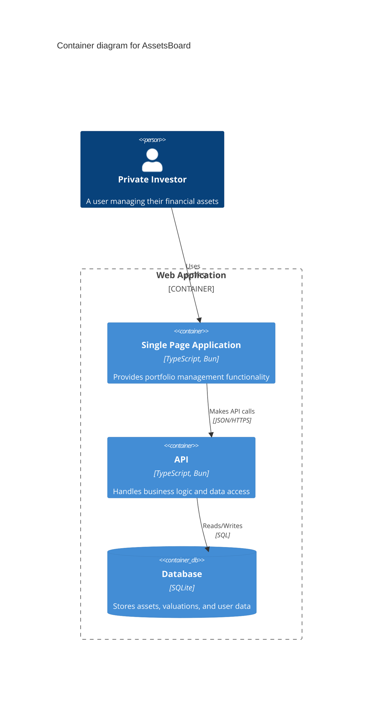

# System architecture for **AssetsBoard**

## Overview

AssetsBoard is a web application for private investors that enables them to categorize and summarize their financial assets. The system allows users to record financial assets with their categorization, manage asset values over time, and generate portfolio analytics.

## Frontend

### Tech Stack

- **Language**: TypeScript
- **Framework**: Bun_Vanilla_TS
- **Styling**: PicoCSS
- **State Management**: None
- **Routing**: None
- **API**: Fetch

### Architecture

- Layered
- Functional
- Folder structure

  ```
  - src/
    - app/ (pages and repositories)
    - models/ (data models)
    - utils/ (helpers and shared components)
  ```

### Presentation

- Single Page Application
- Responsive
- Dark Mode
- Colors: Lime, Cyan
- Fonts: Tomorrow, Fira Mono

## Backend

### Tech Stack

- **Language**: TypeScript
- **Framework**: Bun_Vanilla_TS

### Architecture

- Layered
- Functional
- Folder structure

  ```
  - src/
    - api/ (controllers and repositories)
    - models/ (data models)
    - utils/ (helpers)
  ```

### Authentication

- JWT

### Database

- Relational
- SQLite
- Naming convention: snake_case
- Main tables: assets, categories, valuations, users
- Identifiers: id
- Indexes: user_id, asset_id, category_id

## Diagram



_End of System Architecture Document for AssetsBoard_
